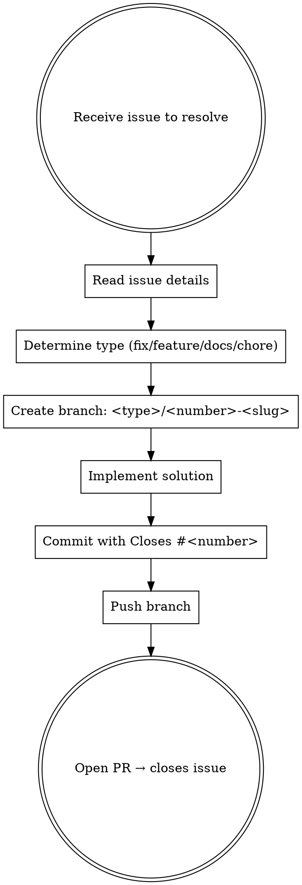

# GitHub Issue Workflow

## Overview

When resolving a GitHub issue, always work in an isolated branch named after the issue number, then open a PR that closes the issue.

## Workflow



## Branch Naming Convention

Format: `<type>/<issue-number>-<brief-kebab-case-description>`

| Type | When to use |
|------|-------------|
| `fix` | Bug fix, error correction |
| `feature` | New functionality |
| `docs` | Documentation only |
| `chore` | Maintenance, refactor, deps |
| `test` | Tests only |

**Examples:**
- `fix/42-login-redirect-error`
- `feature/123-add-rpe-chart`
- `docs/15-update-readme`
- `chore/7-upgrade-dependencies`

**Rules:**
- Always include the issue number immediately after the type prefix
- Slug is lowercase, hyphen-separated, max 5 words
- No spaces, no uppercase, no special chars in slug

## Step-by-Step

### 1. Read the issue

```bash
gh issue view <number>
```

Read title, body, labels, and any comments to understand the full scope.

### 2. Create the branch

```bash
git checkout develop && git pull origin develop
git checkout -b fix/<number>-<slug>
```

Always branch off the latest `develop`.

### 3. Implement and commit

- Make the minimal change that resolves the issue
- Commit message must reference the issue:

```bash
git commit -m "fix: <what was fixed>

Closes #<number>"
```

### 4. Push and open PR

```bash
git push -u origin fix/<number>-<slug>

gh pr create \
  --base develop \
  --title "<concise title>" \
  --body "$(cat <<'EOF'
## Summary
- <bullet point of what changed>

## Closes
Closes #<number>

🤖 Generated with [Claude Code](https://claude.com/claude-code)
EOF
)"
```

The `Closes #<number>` keyword in the PR body (or commit message) automatically closes the issue when the PR is merged.

## Common Mistakes

| Mistake | Correct approach |
|---------|-----------------|
| Branch without issue number (`fix/login-bug`) | Always include number: `fix/42-login-bug` |
| Branch off stale local main | Always `git pull` before branching |
| PR without `Closes #N` | Include in PR body to auto-close issue |
| Implementing more than needed | Stay scoped to what the issue describes |
| Forgetting to push before creating PR | `git push -u origin <branch>` first |
| PR verso `master` invece di `develop` | Usare sempre `--base develop`; master riceve solo merge da develop |
